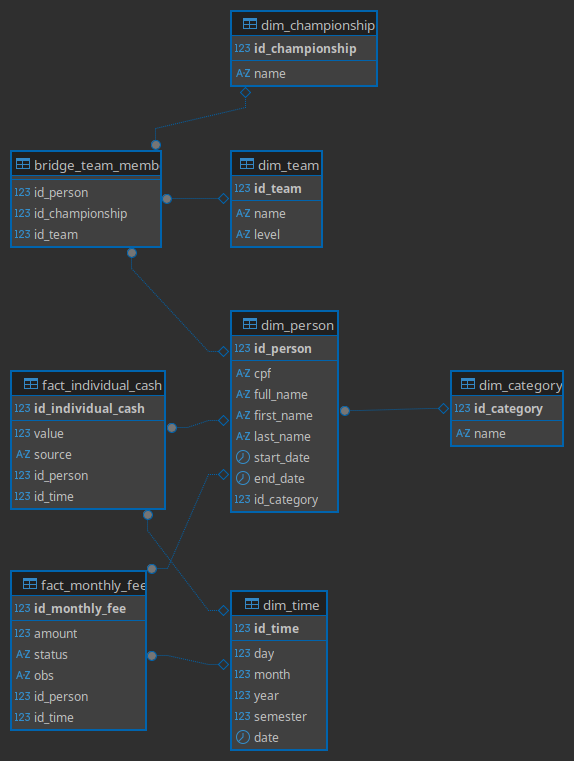

# Projeto: Cheer Finance DW (Financeiro Furiosos)


Sobre o projeto
---
Este é um projeto de portfólio de Engenharia de Dados que implementa um pipeline de ETL (Extract, Transform, Load) completo. O objetivo é extrair dados brutos e desestruturados de planilhas financeiras (Excel/CSV) de um time universitário de cheerleading e carregá-los em um **Data Warehouse (DW) dimensional**  limpo e estruturado.

O banco de dados é modelado como um **Snowflake Schema** (uma variação do Star Schema) para permitir análises robustas das finanças, associados e participações em campeonatos.

Resumo
---
O projeto é executado em duas etapas principais, utilizando um diretório out/ como Staging Area intermediária:

#### O Fluxo do Pipeline
1. Transform (`transform.py`): Extrai dados de múltiplas fontes (Excel/CSV), aplica regras de negócio (limpeza, normalização de CPFs, melt de planilhas) e salva os DataFrames limpos como arquivos CSV na pasta `out/`.

2. Load (`load.py`): Conecta-se ao banco de dados MySQL, executa lookups (para buscar chaves substitutas como `id_person`) e carrega os dados dos CSVs de staging para as tabelas de fatos e dimensões no Data Warehouse.

#### Modelo de Dados (Snowflake Schema)



#### Tecnologias Utilizadas

- Python 3.10+

- Pandas: Para extração e transformação de dados.

- PyMySQL: Conector para o banco de dados.

- MySQL (via Docker): Banco de dados relacional para o Data Warehouse.

- Docker & Docker Compose: Para gerenciamento de contêineres e ambiente de banco de dados.

Pré-requisitos
---
- Linux
- Python 3.10+ (o projeto foi desenvolvido/testado com 3.12)
- Docker & docker-compose

Instalação de dependências
---
1.Clonar o Repositorio
```bash
git clone https://github.com/LuBruck/Finance_Data_Eng_Project/tree/main
```
2. Criar venv e ativar:
```bash
python -m venv venv
source venv/bin/activate
```
3. Instalar requirements:
```bash
pip install -r requirementes.txt
```

4. Configurar e Iniciar o Banco de Dados (Docker)
```bash
# Crie e edite o arquivo .env com suas senhas e portas
cp .env_exemple .env

#suba o conteiner do MySQL
docker compose up -d
```
O contêiner MySQL é configurado para executar automaticamente todos os scripts da pasta `sql_script/` na primeira inicialização, criando todo o schema do Data Warehouse.


Executando o Pipeline
---
1. Gerar arquivos transformados (saída em `out/`):
```bash
python transform.py
```
- Isso roda `transform_monthly_fee_data`, `transform_person_master` e `transform_individual_cash`.
- Saídas esperadas (nomes aproximados): `out/person_master`, `out/team_person`, `out/championship_team`, `out/ControleMensalidade`, `out/individual_cash`.

2. Carregar dados no banco:
```bash
python load.py
```
- `load.py` conecta ao MySQL usando variáveis do `.env`.
- Fluxo no `load.py` (no `__main__`):
  - `load_dim_time` (preenche `dim_time`)
  - `load_dim_championship`, `load_dim_category`, `load_dim_team`
  - `load_dim_person`
  - `load_bridge_team_member`
  - `load_fact_monthly` (fato mensal)
  - `load_fact_individual_cash` (caixa individual)

Observações importantes
---
- Execute `transform.py` antes de `load.py` para garantir arquivos em `out/`.
- Formatação de CPF: os transformadores já tentam limpar/padronizar (remover . e - e zfill para 11 dígitos). Se houver mismatch com DB, normalize os CPFs em ambos lados.
- Erro comum: `pymysql.err.ProgrammingError: nan can not be used with MySQL` — significa que há NaN nos records. As funções de load devem converter NaN -> None antes do `executemany`. Caso ocorra, verifique os CSVs em `out/` e garanta preenchimento/remoção de linhas inválidas.
- `dim_time` é populada com `insert_time_data(start_date, end_date)`; ajustar o intervalo caso necessário.

Principais funções e onde olhar
---
- transform.py
  - `transform_monthly_fee_data(caminho_controle, caminho_out)` — cria `dt_mensalidade_out`.
  - `transform_person_master(path_in, path_out)` — gera `person_master`, `team_person`, `championship_team`.
  - `transform_individual_cash(path_in, path_out)` — extrai pagamentos individuais.
- load.py
  - `load_dim_time`, `insert_time_data`
  - `_load_generic_dimension` — inserir dimensões (atenção: validação de colunas)
  - `_lookup_id` — retorna dict {key -> id}
  - `load_dim_person`, `load_bridge_team_member`, `load_fact_monthly`, `load_fact_individual_cash`

Dicas de debug rápido
---
- Verifique arquivos de saída em `out/` com `head` ou `pandas.read_csv`.
- Teste mapeamentos manualmente:
```python
from load import _lookup_id
print(_lookup_id(conn, 'dim_person', 'cpf', 'id_person')[:5])
```
- Se `person_id` ou `id_time` vierem `NaN`, o `map` não encontrou correspondência — confira normalização das chaves (strings, zeros à esquerda, espaços).
- Se o container MySQL não aplicar scripts SQL, verifique permissões do volume e logs do container.

Estrutura de pastas (resumo)
---
- data/ — planilhas originais
- out/ — arquivos transformados (gerados)
- sql_script/ — DDL para criar schema/tabelas
- transform.py — ETL (extração e transformação)
- load.py — carregamento no banco
- requirementes.txt — dependências

